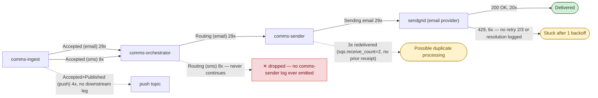
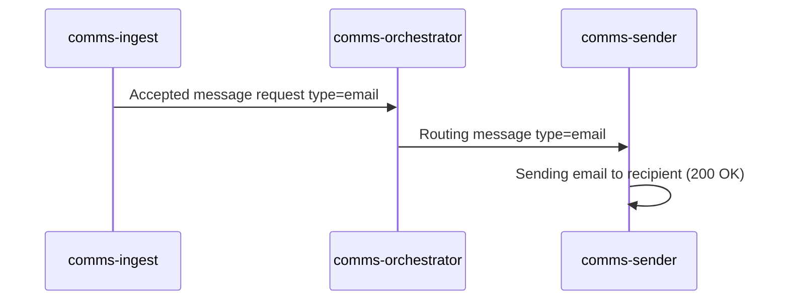
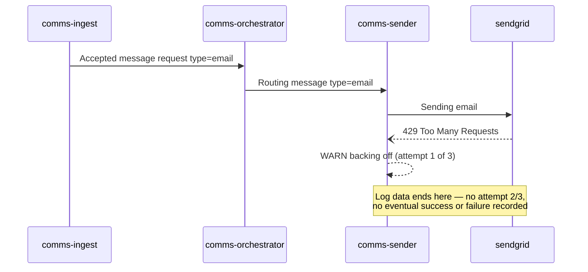
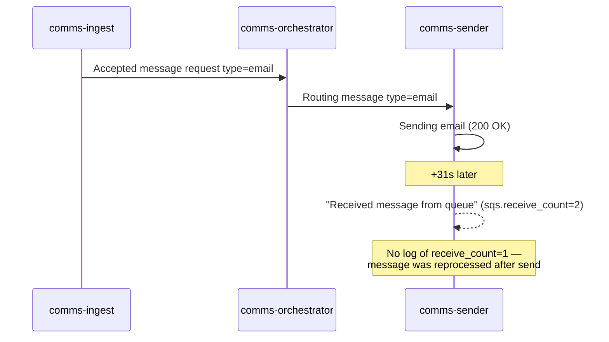
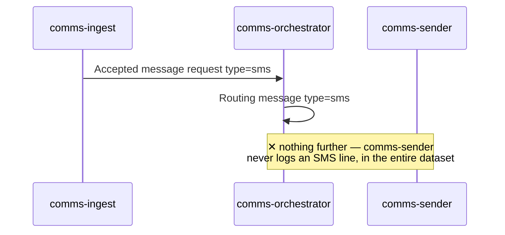
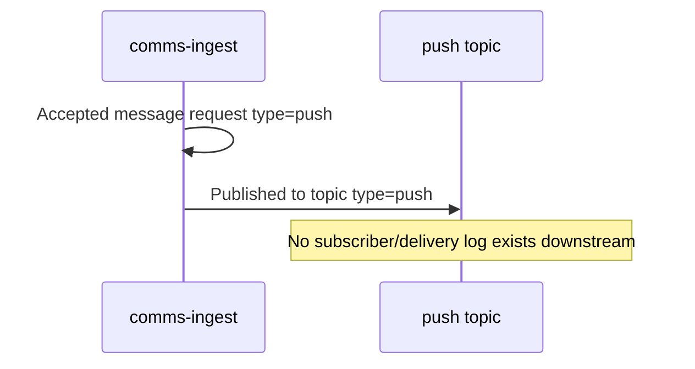
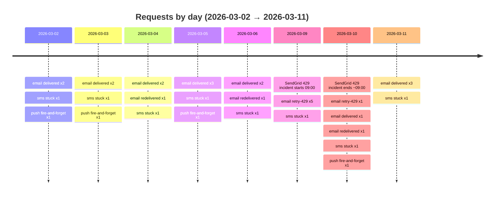

# Comms Pipeline — Log Analysis

Source: `data/data/logs.json` — 2,820 log lines, 2026-03-02 → 2026-03-11, three services (`comms-ingest`, `comms-orchestrator`, `comms-sender`).

## TL;DR

- **96% of the file is noise.** Health-check pings and zero-value metrics account for 2,700 of 2,820 lines. Filtered out below.
- The remaining **120 lines cover 41 real message requests**, traceable end-to-end via `attributes.correlation_id`.
- **Every single SMS request (8/8) dies silently at the orchestrator** — it's routed but never reaches `comms-sender`. 100% failure rate for that channel.
- A **SendGrid 429 incident** hit 6 emails between 2026-03-09 09:00 and 2026-03-10 09:00, and none of them show a retry attempt 2, 3, or resolution — the backoff logging is a dead end.
- 3 emails show a **duplicate delivery signature** (`sqs.receive_count: 2` with no prior "received" log), suggesting messages are being reprocessed without a visible first attempt.
- Push notifications are logged as **fire-and-forget** — published to a topic with no downstream confirmation anywhere in the log data (may be by design, but there's no evidence either way from these logs).

---

## What was filtered out

| Pattern | Service(s) | Count | Verdict |
|---|---|---|---|
| `GET /health 200` | all 3 | 1,200 | Pure noise — periodic health probe, zero information content |
| `queue depth metric recorded depth=0` | all 3 | 1,200 | Noise — metric is always 0 in this dataset, never varies |
| `Polling queue: received 0 messages` | comms-orchestrator | 300 | Noise — empty-poll heartbeat, never carries data |
| **Total filtered** | | **2,700 (96%)** | |
| **Kept (signal)** | | **120 (4%)** | Everything below is built from these lines |

---

## System topology & where flows actually go

---

## Flow patterns (sequence diagrams)

### 1. Healthy email — 20 of 29 (69%)

### 2. SendGrid 429 — 6 of 29 emails (21%), all 2026-03-09/10

### 3. Redelivered / possible duplicate — 3 of 29 emails (10%)

### 4. SMS — 8 of 8 (100%) stuck at routing

### 5. Push — 4 of 4 (100%) fire-and-forget

---

## Incident timeline

---

## Full request ledger (41 requests)

| corr id | datetime (UTC) | tenant | type | outcome |
|---|---|---|---|---|
| corr-0001 | 2026-03-02 09:00:00 | org-1042 | email | ✅ delivered |
| corr-0002 | 2026-03-02 11:13:00 | org-2288 | email | ✅ delivered |
| corr-0003 | 2026-03-02 13:26:00 | org-1042 | sms | ✕ stuck at routing |
| corr-0004 | 2026-03-02 15:39:00 | org-3310 | email | ✅ delivered |
| corr-0005 | 2026-03-02 17:52:00 | org-4471 | push | ➜ fire-and-forget |
| corr-0006 | 2026-03-03 09:00:00 | org-1042 | email | ✅ delivered |
| corr-0007 | 2026-03-03 11:13:00 | org-2288 | sms | ✕ stuck at routing |
| corr-0008 | 2026-03-03 13:26:00 | org-5502 | email | ✅ delivered |
| corr-0009 | 2026-03-03 15:39:00 | org-2288 | email | ✅ delivered |
| corr-0010 | 2026-03-03 17:52:00 | org-4471 | push | ➜ fire-and-forget |
| corr-0011 | 2026-03-04 09:00:00 | org-3310 | email | ✅ delivered |
| corr-0012 | 2026-03-04 11:13:00 | org-1042 | email | ✅ delivered |
| corr-0013 | 2026-03-04 13:26:00 | org-6614 | sms | ✕ stuck at routing |
| corr-0014 | 2026-03-04 15:39:00 | org-2288 | email | ⚠ redelivered (dup?) |
| corr-0015 | 2026-03-04 17:52:00 | org-5502 | email | ✅ delivered |
| corr-0016 | 2026-03-05 09:00:00 | org-1042 | email | ✅ delivered |
| corr-0017 | 2026-03-05 11:13:00 | org-3310 | sms | ✕ stuck at routing |
| corr-0018 | 2026-03-05 13:26:00 | org-4471 | email | ✅ delivered |
| corr-0019 | 2026-03-05 15:39:00 | org-6614 | email | ✅ delivered |
| corr-0020 | 2026-03-05 17:52:00 | org-1042 | push | ➜ fire-and-forget |
| corr-0021 | 2026-03-06 09:00:00 | org-2288 | email | ✅ delivered |
| corr-0022 | 2026-03-06 11:13:00 | org-5502 | email | ⚠ redelivered (dup?) |
| corr-0023 | 2026-03-06 13:26:00 | org-1042 | sms | ✕ stuck at routing |
| corr-0024 | 2026-03-06 15:39:00 | org-3310 | email | ✅ delivered |
| corr-0025 | 2026-03-06 17:52:00 | org-1042 | email | ✅ delivered |
| corr-0026 | 2026-03-09 09:00:00 | org-1042 | email | 🛑 429, no retry logged after attempt 1 |
| corr-0027 | 2026-03-09 11:13:00 | org-2288 | email | 🛑 429, no retry logged after attempt 1 |
| corr-0028 | 2026-03-09 13:26:00 | org-5502 | sms | ✕ stuck at routing |
| corr-0029 | 2026-03-09 15:39:00 | org-3310 | email | 🛑 429, no retry logged after attempt 1 |
| corr-0030 | 2026-03-09 17:52:00 | org-6614 | email | 🛑 429, no retry logged after attempt 1 |
| corr-0031 | 2026-03-09 10:05:00 | org-4471 | email | 🛑 429, no retry logged after attempt 1 |
| corr-0032 | 2026-03-10 09:00:00 | org-1042 | email | 🛑 429, no retry logged after attempt 1 |
| corr-0033 | 2026-03-10 11:13:00 | org-2288 | email | ✅ delivered |
| corr-0034 | 2026-03-10 13:26:00 | org-3310 | sms | ✕ stuck at routing |
| corr-0035 | 2026-03-10 15:39:00 | org-5502 | email | ⚠ redelivered (dup?) |
| corr-0036 | 2026-03-10 17:52:00 | org-6614 | push | ➜ fire-and-forget |
| corr-0037 | 2026-03-11 09:00:00 | org-1042 | email | ✅ delivered |
| corr-0038 | 2026-03-11 11:13:00 | org-3310 | email | ✅ delivered |
| corr-0039 | 2026-03-11 13:26:00 | org-2288 | sms | ✕ stuck at routing |
| corr-0040 | 2026-03-11 15:39:00 | org-6614 | email | ✅ delivered |
| corr-0041 | 2026-03-11 17:52:00 | org-5502 | email | ✅ delivered |

---

## By tenant

| Tenant | Email | SMS | Push | Total |
|---|---|---|---|---|
| org-1042 | 8 | 2 | 1 | 11 |
| org-2288 | 6 | 2 | 0 | 8 |
| org-3310 | 5 | 2 | 0 | 7 |
| org-4471 | 2 | 0 | 2 | 4 |
| org-5502 | 5 | 1 | 0 | 6 |
| org-6614 | 3 | 1 | 1 | 5 |

Every tenant that sends SMS sees 100% of those requests get stuck — this isn't a tenant-specific or load-specific issue, it's systemic to the SMS path.

---

## Issues, ranked

1. **SMS delivery is completely broken.** 8/8 requests routed by `comms-orchestrator` and never picked up by `comms-sender`. No error, no warning — just silence. This is the highest-severity finding: a whole channel appears dead with no alerting signal in these logs.
2. **SendGrid 429 backoff never resolves.** 6 emails across a 24h window (2026-03-09 09:00 → 2026-03-10 09:00) hit a 429, log "attempt 1 of 3," and then nothing — no attempt 2, no attempt 3, no success/failure. Either the retry logic isn't logging its later attempts, or the retries aren't happening at all.
3. **Possible duplicate email sends.** 3 emails show `sqs.receive_count: 2` on a "Received message from queue" log with no earlier receive-count-1 log for the same correlation id — the message was sent successfully, then reprocessed ~31s later. Worth checking for double-sends to end recipients.
4. **Push has no delivery confirmation anywhere in scope.** Could be intentional (fire-and-forget pub/sub), but as-is there's no log evidence a push notification ever reaches a device.
5. **Noise-to-signal ratio (96%) makes real issues easy to miss.** The health/heartbeat/poll logs should be sampled or dropped from default log level in production if this volume is representative.
