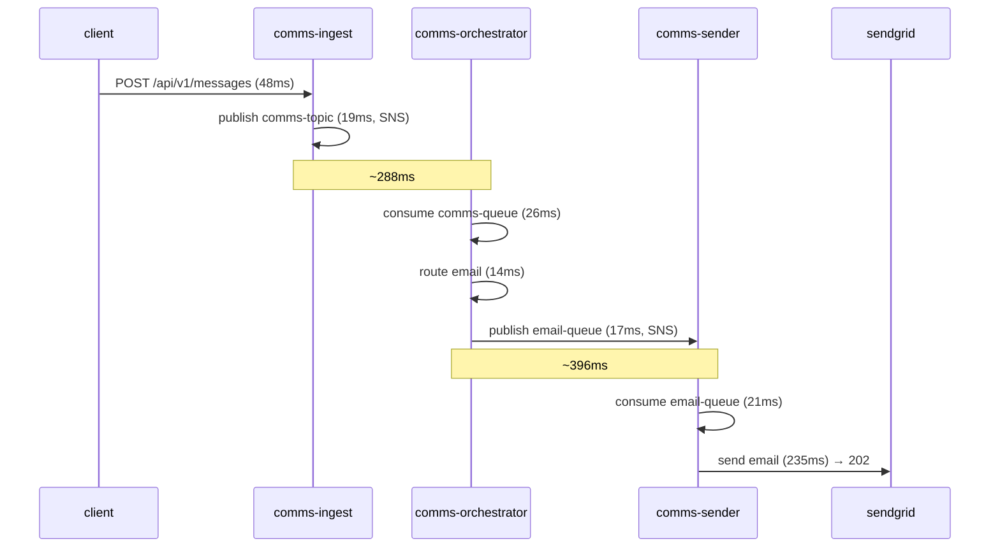
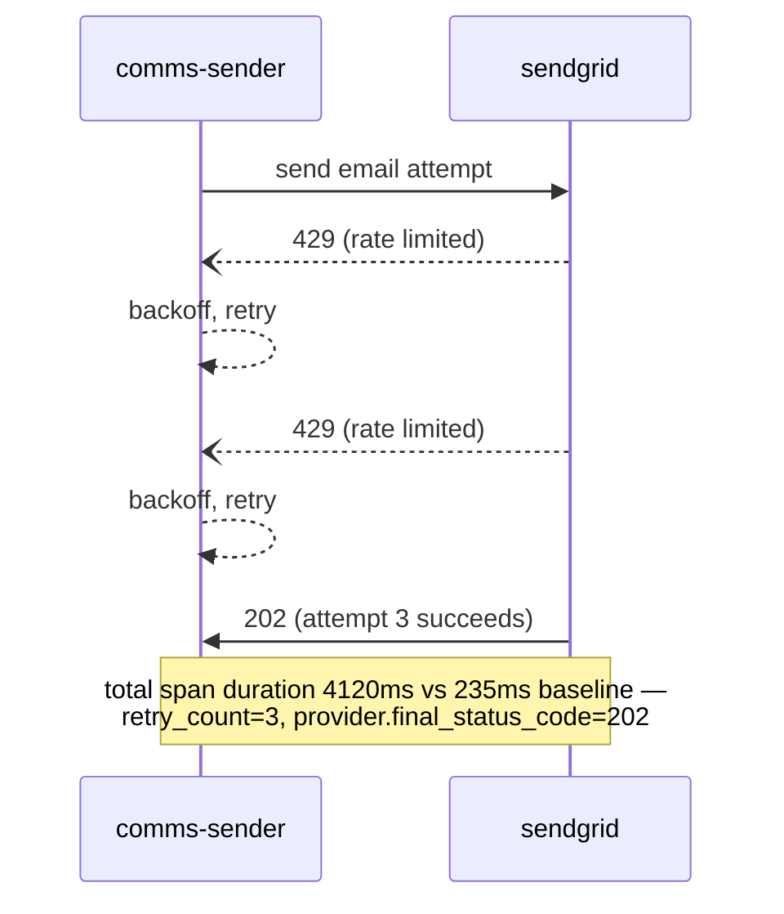
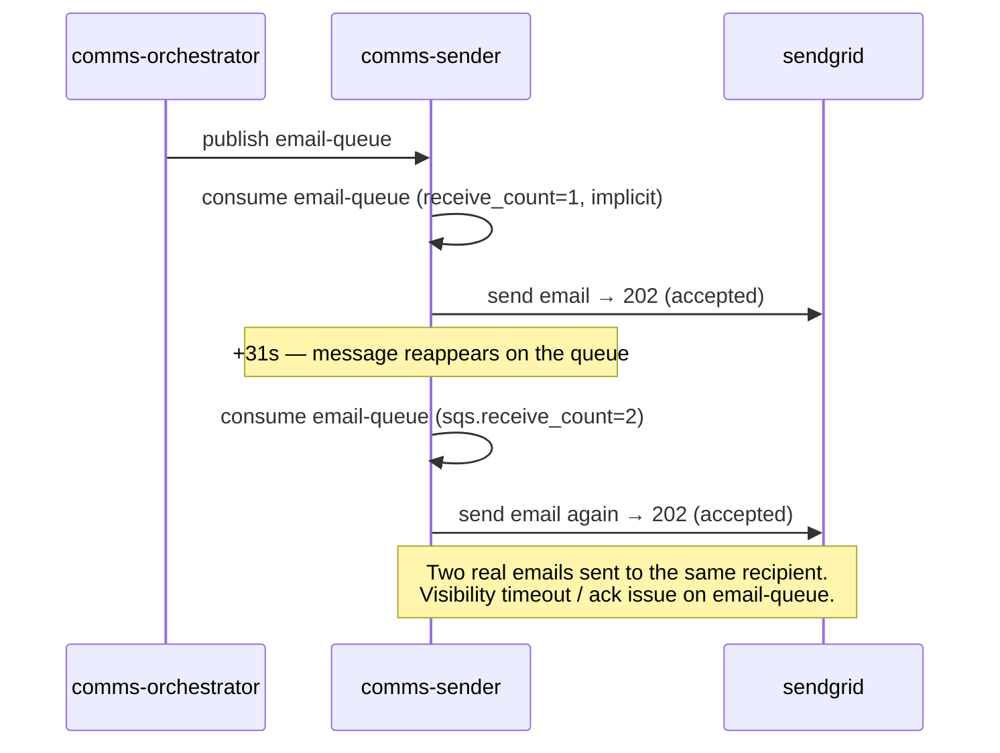
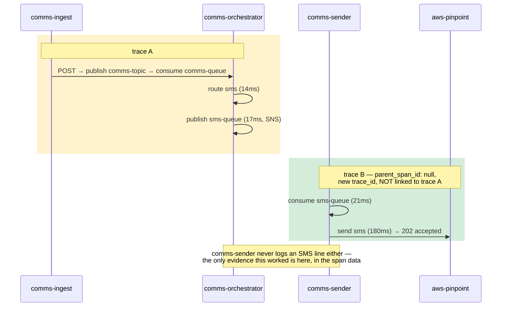
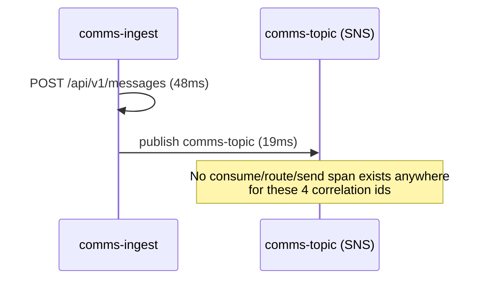

# Comms Pipeline — Distributed Trace Analysis

Source: `data/data/spans.json` — 273 spans, 49 trace IDs, 41 requests, 2026-03-02 → 2026-03-11. Same three services as the [log analysis](comms-pipeline-log-insights.md), but this is OpenTelemetry-style span data: parent/child hierarchy, `duration_ms`, provider status codes, retry counts.

## TL;DR — this corrects two of the log-based findings

Spans capture what actually happened at the network/provider boundary, which the structured logs didn't always record. Cross-checking the two:

| Finding (from logs) | What the spans actually show |
|---|---|
| "SMS is 100% broken — dead at routing" | **SMS delivery succeeds** (`send sms` → `aws-pinpoint` → `202`, all 8/8). The real bug: trace context isn't propagated across the `sms-queue` hop (a *second*, disconnected trace starts in `comms-sender`), and `comms-sender` emits **zero log lines** for SMS at all — a pure observability gap, not a functional one. |
| "SendGrid 429s never resolve" | They **do resolve** — `retry_count: 3`, `provider.final_status_code: 202` on all 6. The backoff logic works; it just never logs its own success, so the log trail dead-ends at "attempt 1 of 3" while the span shows the full retry-and-recover. |
| "3 emails look duplicated" | **Confirmed as a real bug**, not a logging artifact — both attempts show `provider.status_code: 202` (accepted) from SendGrid, 31s apart, for the same correlation id. Two real emails went out. |
| "Push is fire-and-forget" | **Confirmed** — spans stop after `publish comms-topic`, no consumer span exists for any of the 4 push requests. |

Net effect: logs alone made this system look worse than it is for SMS/retries, but *better* than it is for duplicate sends. Traces were needed to tell which.

---

## Span inventory

| Span name | Service | Kind | Count | Avg duration | Notes |
|---|---|---|---|---|---|
| `POST /api/v1/messages` | comms-ingest | SERVER | 41 | 48ms | one per request, all types |
| `publish comms-topic` | comms-ingest | PRODUCER | 41 | 19ms | → SNS |
| `consume comms-queue` | comms-orchestrator | CONSUMER | 37 | 26ms | 41 − 4 push = 37 (push never consumed) |
| `route email` | comms-orchestrator | INTERNAL | 29 | 14ms | |
| `publish email-queue` | comms-orchestrator | PRODUCER | 29 | 17ms | → SNS |
| `consume email-queue` | comms-sender | CONSUMER | 32 | 21ms | 29 + 3 duplicate redeliveries |
| `send email` | comms-sender | CLIENT | 32 | 233–4120ms | → SendGrid; 6 of these are the 429/retry cases |
| `route sms` | comms-orchestrator | INTERNAL | 8 | 14ms | |
| `publish sms-queue` | comms-orchestrator | PRODUCER | 8 | 17ms | → SNS; **trace context lost here** |
| `consume sms-queue` | comms-sender | CONSUMER | 8 | 21ms | starts a **new, disconnected trace** (`parent_span_id: null`) |
| `send sms` | comms-sender | CLIENT | 8 | 180ms | → AWS Pinpoint; all `202`, `retry_count: 0` |

All 273 spans report `status: OK` — nothing is marked as an error span, even the 429s. Provider failures only show up in `attributes.provider.status_code`, not in span status.

---

## Request-hop latency (happy-path email)

End-to-end median latency for a healthy email is ~**1.0s** from `POST` to provider accept; the two SNS→SQS queue hops (ingest→orchestrator, orchestrator→sender) account for ~680ms of that, more than the actual work.

---

## Waterfalls by outcome

### 1. Happy-path email (corr-0001) — 20 of 29 emails

### 2. SendGrid 429, then recovers (corr-0026) — 6 of 29 emails, all 2026-03-09/10

### 3. Duplicate send (corr-0014, corr-0022, corr-0035) — 3 of 29 emails

### 4. SMS — trace breaks at the queue boundary, but delivery succeeds (all 8/8)

### 5. Push — fire-and-forget, confirmed (4/4)

---

## Findings, ranked

1. **Duplicate email sends are real (not a log artifact).** corr-0014, corr-0022, corr-0035 each show two `send email` spans, both accepted (`202`) by SendGrid, 31 seconds apart, second one tagged `sqs.receive_count: 2`. The message becomes visible on `email-queue` again before the consumer acks it — likely a visibility-timeout/ack-timing issue in `comms-sender`. This is the top real bug in the pipeline.
2. **SMS trace propagation breaks at `publish sms-queue` → `consume sms-queue`.** Every one of the 8 SMS spans in `comms-sender` starts a brand-new trace (`parent_span_id: null`) instead of continuing the parent trace from `comms-orchestrator`. Email and push don't have this problem — only the SNS topic feeding `sms-queue` is missing trace-header propagation. This alone would make SMS look "untraceable" in any tracing UI grouped by trace_id.
3. **`comms-sender` never logs anything for SMS**, even though it successfully sends 8/8 via AWS Pinpoint. Combined with #2, this is why the log-only analysis concluded SMS was completely dead — it wasn't; it's just invisible in logs and split across two traces.
4. **429 backoff recovers but under-logs.** All 6 rate-limited sends eventually succeed (`retry_count: 3`, final `202`), at a cost of ~4.1s vs the 235ms baseline (17x latency). Worth alerting on `send email` spans over ~1s as a proxy for provider throttling, since the logs won't surface it.
5. **Queue hops dominate latency.** ~680ms of the ~1000ms happy-path latency is the two SNS→SQS transitions, not application work. If latency matters more than the ~250ms of actual send time, that's where to look.
6. **No span ever has `status != OK`**, including the 429s and the SMS trace break. If you're alerting on span status in an APM tool, none of these issues would fire — they're only visible by reading `attributes` (status codes, retry counts, `parent_span_id`).
